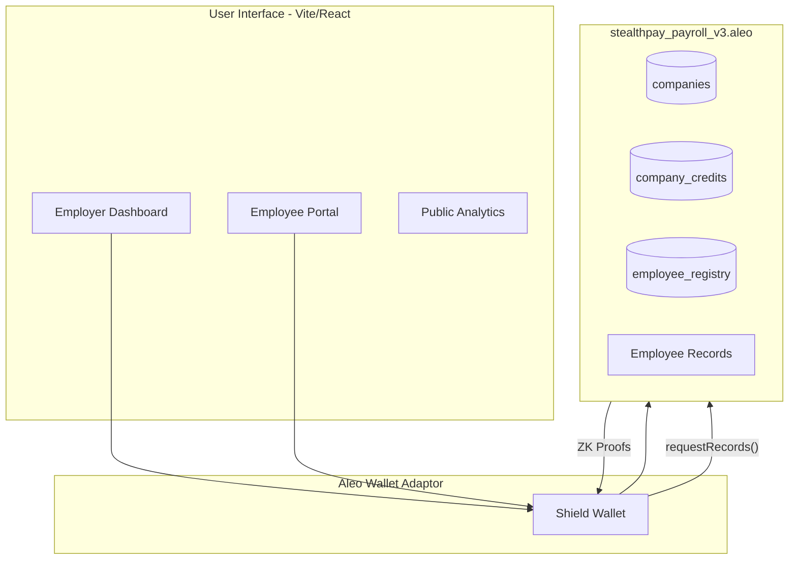

# 🛡️ StealthPay Protocol

**Privacy-First, On-Chain Payroll for the Aleo Network.**

StealthPay is an institutional-grade, decentralized payroll protocol that enables organizations to disburse salaries in **ALEO credits** and **USDCX stablecoins** with zero-knowledge privacy. By utilizing the Aleo blockchain, StealthPay ensures that sensitive compensation data — including individual salaries, payment frequencies, and employee identities — remains cryptographically encrypted and hidden from the public ledger.

---

## 📖 Table of Contents
- [The Problem: Public Exposure](#the-problem-public-exposure)
- [The Solution: ZK-Privacy by Default](#the-solution-zk-privacy-by-default)
- [Protocol Features](#protocol-features)
- [Technical Architecture](#technical-architecture)
- [Smart Contract Specification](#smart-contract-specification)
- [AI Payroll Intelligence](#ai-payroll-intelligence)
- [Privacy Model & ZK Commitments](#privacy-model--zk-commitments)
- [Local Development & Deployment](#local-development--deployment)
- [Protocol Roadmap](#protocol-roadmap)

---

## ⚠️ The Problem: Public Exposure
Institutional adoption of blockchain payroll has been historically blocked by the **lack of financial privacy**. On public chains:
- **Competitors** can monitor hiring velocity, headcount, and compensation benchmarks.
- **Employees** lose their right to financial anonymity; their net worth and spending habits become publicly traceable.
- **HR/Legal Teams** face compliance risks by broadcasting sensitive internal data to a global audience.

## ✅ The Solution: ZK-Privacy by Default
StealthPay utilizes Aleo's native **Zero-Knowledge (ZK)** execution environment to achieve:
- **Zero-Plaintext Storage:** Salary amounts are never stored as readable numbers; they are committed via `BHP256` hashes.
- **Recipient Privacy:** Payments are settled as private ZK records that only the recipient can decrypt via their viewing keys.
- **Verifiable Solvency:** Auditors can verify that the payroll vault is fully funded and disbursed WITHOUT learning individual salary details.

---

## 🚀 Protocol Features

### 🏦 For Employers
- **Company Registry:** One-click on-chain registration for organizations.
- **Multi-Token Vaults:** Fund your payroll with native **ALEO Credits** or **USDCX** stablecoins.
- **Hybrid Payout Models:** Support for both **Lump-Sum** (interval-based) and **Real-Time Streaming** (per-block accrual).
- **One-Time Bonuses:** Integrated "Gift" feature for instant token disbursements outside the standard payroll cycle.

### 👤 For Employees
- **Private Access:** View salary, stream progress, and payment history in total privacy.
- **Self-Sovereign Claims:** Employees trigger their own payout claims via private ZK proofs.
- **Lifetime Earnings Tracker:** Monitor total accumulated wealth from the protocol.

### 📊 Public Transparency
- **Global TVL:** A public-facing monitor (powered by `credits.aleo` ledger) showing the total value secured by the protocol.
- **Active User Metrics:** Real-time visibility into the growth of the on-chain workforce.

---

## 🏗 Technical Architecture



---

## 🔐 Privacy Model & ZK Commitments

Salaries are committed to the ledger during the onboarding transition using a client-side secret:

$$commitment = BHP256(salary + secret)$$

At the time of claim, the employee's browser generates a ZK proof demonstrating they know the `salary` and `secret` that hashed to the value in the public registry. The contract validates the proof and mints a private `credits` record to the employee's wallet. **The plaintext salary never touches the internet or the secondary ledger.**

---

## 🤖 AI Payroll Intelligence

StealthPay integrates an embedded AI analytics layer powered by **Claude Haiku (`claude-haiku-4-5`)** via a Vercel serverless function (`/api/analyze`). The model is intentionally lightweight — fast, low-latency, and cost-efficient for structured payroll analysis tasks.

The AI helps finance teams detect:
- **Anomalies:** High-severity salary outliers or underfunded vaults.
- **Insights:** Distribution analysis between Streaming vs. Lump-Sum models.
- **Recommendations:** Suggested actions for capital efficiency and payroll health.

**Privacy guarantee:** AI analysis runs only on aggregated, employer-visible data (employee count, payment type distribution, funding levels). ZK secrets, private records, and individual salary amounts are never sent to the model or any external API.

---

## 🛠 Local Development

### Prerequisites
- [Leo CLI](https://developer.aleo.org/leo/installation) v3.4+
- [Node.js](https://nodejs.org) v18.17+
- [Shield Wallet](https://shieldwallet.io)

### Setup & Run
```bash
# 1. Install frontend dependencies
cd frontend
npm install

# 2. Configure Environment
# Rename .env.example to .env.local and add your ANTHROPIC_API_KEY
npm run dev
```

### Deploy Smart Contract
```bash
cd contracts/stealthpay
# Ensure your .env has your PRIVATE_KEY
leo build
leo deploy --broadcast --yes
```

---

## 📜 License
StealthPay is released under the **MIT License**.

Built with 🛡️ for the [Aleo Network](https://aleo.org).
